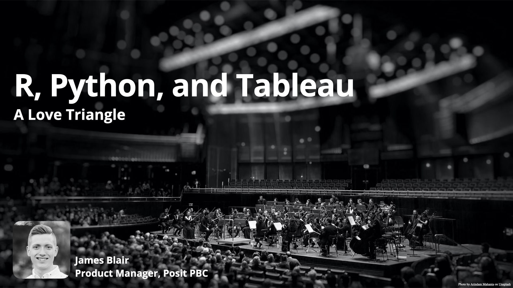

# R, Python, and Tableau: A Love Triangle

Slides for a talk given at RStudio::conf 2022.

### Resources
- [plumbertableau](https://rstudio.github.io/plumbertableau/)
- [fastapitableau](https://rstudio.github.io/fastapitableau/)
- [shinytableau](https://rstudio.github.io/shinytableau/)
- [Music Dashboard Example](https://github.com/sol-eng/tableau-examples/tree/main/music)